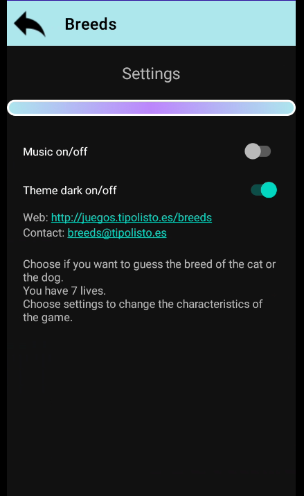
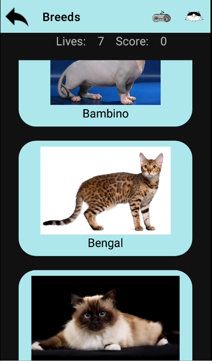

# Razas / Breeds

 Es un juego para android, disponible para su descarga en: 
 
 It is an android game, available for download at:

 https://play.google.com/store/apps/details?id=es.tipolisto.breeds

# Intrucciones / Instructions
 
En el que tienes que adivinar la raza del perro o del gato.

Cuantos más puntos consigas, más arriba estarás en la tabla de records.

Para ayudarte tienes en la barra de acción de la parte superior unos pequeños iconos que te permiten visualizar muchas razas y volver al juego, si pulsas la flecha volverás al menú principal.

-----------

It is a game in which you have to guess the breed of the dog or the cat.

The more points you get, the higher you will be in the record table.

To help you, you have some small icons in the action bar at the top that allow you to view many races and return to the game, if you press the arrow you will return to the main menu.

🕹️🕹️

# General screens

| &nbsp; | &nbsp; | &nbsp; |  
| :-------------------------------------------------------------: | :---------------------------------------------------------: | :---------------------------------------------------------------:  |
| Icon          | Splah    | Menu              |   
| Records     | Settings    |                                                               |

# Cats screens

| &nbsp; | &nbsp; | &nbsp; |  
| :-------------------------------------------------------------: | :---------------------------------------------------------: | :---------------------------------------------------------------: |                                                  
| Game            | List| Detail         |

# Dog screens

| &nbsp; | &nbsp; | &nbsp; |  
| :-------------------------------------------------------------: | :---------------------------------------------------------: | :---------------------------------------------------------------: |                                                  
| Game | List | Detail                   |

    

 

# Desarrollo / Development
Parte kotlin:

    Librerías:
        Navigation: poara movernos entre screens compose
        

Parte Java:
    Librerias:

        Picasso: para las fotos
        Room: para la base de datos
        Retrofit: para las peticiones REST
    Fragments: X

    Actividades	X

    Componentes de la arquitectura	

        Datastore	
        ViewBinding(vinculación de vista)	
            Binding en activities X
            Binding en fragments X
            Binding en recyclerViews
        LiveData X	
        Biblioteca de paginación	
        ViewModel X	
        WorkManager	
        Coorutinas	
    Componentes de navegación

        Navigation drawer	
        View pager
    Intents y filtros de intents X 

    Interface de usuario

        Diseños	
            MotionLayout para el movimiento de tu diseño	
            ConstraintLayout X	
            RecyclerView X	
            Linear layout X	
        Apariencia y estilo	
            Estilos y temas	X
            Botones	X
            Casillas de verificación X	
            Selectores - switch (en fragmentSettings))	
        Barra de tu app	X (toolbar)
        Dialogos X	
        Menus X
        Copiar y pegar	

    Audio y video X, mediaPlayer	

    Permisos X	

    Archivos y datos de la aplicación	
    room X

## Apis

### https://thecatapi.com/

Documentation: https://developers.thecatapi.com/view-account/ylX4blBYT9FaoVd6OhvR?report=bOoHBz-8t

En la aplicación utilizamos estos endpoints

Para obtener 60 imágenes de gatos: https://api.thecatapi.com/v1/breeds

Para obtener información de una raza específica: https://api.thecatapi.com/v1/images/4lXnnfxac

### https://rapidapi.com/myapos--FqlEzvrlv/api/fish-species/

